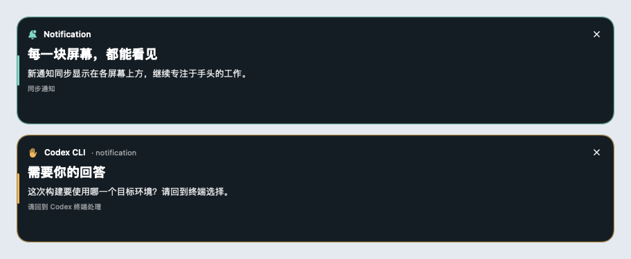

# Notification

**让提醒出现在每一块屏幕。**


macOS 菜单栏工具：将系统通知同步镜像到所有连接屏幕的上方中央，并接收终端 Codex 需要人工审批、回答问题的提醒。

这是实验版本。应用保留 macOS 原有通知，通过只读方式观察通知中心数据库。Apple 没有为第三方应用提供公开的全局通知接管接口，数据库结构、权限和内容可能随系统版本改变；目前不能承诺接收率为 100%。

## 能做什么

- 每个连接屏幕同时显示浮层；默认宽 880 点，高度随内容收紧、最高 156 点，较窄屏幕会限制宽度。普通提醒约 10 秒后消失，人工介入提醒保留到处理或手动关闭。
- 浮层不会主动抢占键盘焦点；任意屏幕关闭一条提醒，会同步关闭其他屏幕上的同一条。
- 常驻菜单栏，提供暂停、隐藏内容、测试提醒、最近提醒和可选的登录启动。
- 首次连接通知数据库只建立基线，不把已有历史通知重新弹出；新增通知和内容更新会被检测。
- Codex hooks 在审批、提问前发送提醒，在相应工具完成或会话继续后清除。通知工具不返回审批决定。
- 顶栏集中展示项目名、`session-name/window-name/pane-N`、状态与操作；金色状态标签和蓝色按钮分开呈现，底部不预留操作栏。

菜单栏图形为自行绘制的「提示灯＋双屏」，矢量源代码见 [Artwork.swift](Sources/NotificationApp/Artwork.swift)。



上图为实际浮层组件的合成内容预览；多屏实际显示仍需在设备上验收。

## 使用

### 构建、安装与更新

需要 Swift 工具链与 macOS Command Line Tools，无第三方包依赖。应用的最低构建目标为 macOS 13；不同 macOS 通知数据库的兼容性需要单独验证。

在仓库根目录运行：

```bash
./scripts/build-app.sh
ditto build/Notification.app /Applications/Notification.app
open /Applications/Notification.app
```

首次安装及后续更新统一使用 `/Applications/Notification.app`。更新前先从菜单栏退出应用，再执行上述命令。

本地构建使用临时签名，未作 Developer ID 签名或公证。重新构建并替换应用后，系统可能要求重新授予权限。完全磁盘访问需重新开启并退出重开应用，以实际读取结果为准。当前消息打开方式不再需要辅助功能权限。

### 接收系统通知

1. 点击菜单栏 Notification 图标，选择「设置与接入说明」。
2. 在系统设置的「隐私与安全性 → 完全磁盘访问」中添加并开启 `Notification.app`。
3. 退出并重新打开 Notification，确认菜单显示「系统通知：监听中（实验性）」。
4. 点击「发送系统通知测试」，首次使用时允许本应用发送通知。设置中出现「已从通知中心读回，耗时 … 毫秒」才表示这条测试消息通过了 macOS 投递和数据库读取，浮层显示需同时目视核对。耗时从点击后提交测试通知算到 GUI 收到数据库结果，包含系统投递时间。「显示测试通知」仍只检验浮层。
5. 用常用应用各产生一条**新的**真实通知，检查系统和所有屏幕上的浮层是否都出现；单条测试成功不能证明所有应用的覆盖率。

保留原应用的通知权限。关闭横幅或通知中心列表后，只要系统仍把通知写入可读取的数据库，Notification 就有机会接收；若关闭全部通知或消息没有落库，本工具无法补收。隐藏预览的通知只能显示系统实际提供的内容。

### 打开通知来源

普通通知（包括飞书）统一提供「打开应用」，激活对应应用；不定位具体消息、不查询聊天记录，也不需要辅助功能权限。只有 Codex 人工介入提醒保留项目、tmux 定位和恢复命令等专用操作。

### 接收速度

程序监听通知数据库及其写入日志的文件变化，收到变化后立即安排读取；连续写入合并约 10 毫秒，并用 250 毫秒定时检查兜底。数据库版本未变化时不重复解析正文。已移除正常读取后的额外一秒等待，权限或读取失败才延后重试。

这一优化减少的是 Notification 自身的检测等待。飞书向 macOS 提交通知、系统写入数据库，以及浮层槽位已满时的排队仍可能增加总延迟。设置中的系统测试可以测量本机投递到读回的耗时；实际飞书消息的延迟需另外核对。

### 接收 Codex CLI 人工介入提醒

HITL（Human in the Loop）是需要你审批操作或回答问题的时刻。本工具通过 Codex 官方的事件 hooks 接收信号，不需要另起模型会话。

```bash
python3 scripts/install-codex-hooks.py
```

安装器默认引用 `/Applications/Notification.app`，合并当前 `CODEX_HOME`（未设置时为 `~/.codex`）的 `hooks.json`，保留已有 hooks。若应用不在默认位置，增加 `--app '/实际位置/Notification.app'`；先预览可加 `--dry-run`。

在 Codex CLI 中输入 **`/hooks`**，检查并信任新增的 Notification hooks。安装脚本不会代你标记信任。打开新的 CLI 会话，分别验证一次真实的审批和提问；部分专用工具路径可能不触发通用 hooks。

- `PermissionRequest`：需要审批时提醒。无需审批的工具不产生这种提醒。
- `PreToolUse`：匹配 `request_user_input` 与 `request_user_input_async`，在调用前提示需要回答。
- `PostToolUse`：清除对应的同步请求。异步提问返回时用户可能尚未回答，因此不会立即清除。
- `Stop`、`Interrupt`、`SessionEnd`、`UserPromptSubmit`：清除该会话已有的待处理浮层。

浮层顶部显示项目目录名。`~/codex-path/<group>/<project>/` 内的工作目录显示 `<group>/<project>`，子目录也归到该项目；其他目录优先显示 Git 仓库根目录名，否则显示当前目录名。普通系统通知没有工作目录信息时只展示应用来源。

tmux 定位优先把 hook 的会话编号与当前 Codex pane 标题匹配；直接启动的 CLI 还可通过进程父子关系确认来源。共享后台服务的 `TMUX_PANE` 可能属于另一个会话，因此不再单独采用它。标题没有会话编号、截断过短或多个 pane 同时匹配时，不猜测位置，保留项目提醒和恢复命令。确认来源后显示 `session-name/window-name/pane-N`。「打开 tmux」重新核对 pane，切换对应的 session、window 和 pane，并激活已有终端；没有可复用的终端时，通过系统 Terminal 连接。终端有多个窗口或标签时，激活应用后可能仍需手动选中对应窗口。pane 已关闭或 tmux 服务已重启时会显示失败原因。

未取得 tmux 定位信息或跳转失败时，可用「复制恢复命令」复制 `codex resume <session-id>`。审批和回答仍在 Codex 终端完成。卡片仅保留项目、终端位置、简短状态和实际问题或审批说明，移除了「同步通知」「请回到 Codex 终端处理」等固定尾注。

移除本工具安装的 hooks：

```bash
python3 scripts/install-codex-hooks.py --remove
```

## 覆盖范围与边界

| 情况 | 当前行为 |
| --- | --- |
| 通知进入可读取的系统数据库 | 文件变化唤醒读取，250 毫秒兜底检查，解析后进入浮层 |
| 通知没有落库，或两次检查之间已被删除 | 可能无法捕获；不等同于实时拦截系统通知流 |
| 启动前已有通知 | 建立基线，不重放 |
| 通知内容被原应用或系统隐藏 | 不尝试恢复隐藏内容 |
| 暂停、屏幕休眠或会话不可用 | 清除浮层，继续观察来源；恢复时不补弹这段时间的提醒 |
| 多条通知同时到达 | 最多同时显示三条，其中最多两条为持续的人工介入提醒；其余排队 |
| 排队超过 100 条 | 优先丢弃最早的普通提醒，菜单显示累计略过数量 |
| Codex hooks 未信任或运行版本不支持 | 无法得到相应提醒；安装成功不等于已验证真实事件 |
| AppKit 浮层与系统专注模式 | 浮层独立于系统横幅；需要安静时使用本工具的暂停开关 |

通知正文仅在内存中保留最近 50 条，退出后清空。Codex 提醒通过当前用户私有目录的短期事件文件传递，读取后删除，过期事件不再展示；不保存原始命令、完整工具参数或会话记录。软件不向外发送通知内容。

## 验证与开发

```bash
./scripts/test.sh
```

核心检查使用可执行测试程序，因此无需完整 Xcode 或 XCTest。检查覆盖数据库增量读取、hook 生命周期、项目归属、旧事件兼容、子进程超时、文件变化唤醒、日志写入读取、文件替换、兜底定时器及安装器合并。已安装 tmux 时，还会启动独立测试服务和虚拟终端，验证 pane 定位、改名、客户端切换与过期目标；不会操作用户的现有 tmux 服务。真实消息接收、多显示器、终端前台聚焦与权限流程需要在 Mac 上另行验收，详见 [验证记录](docs/verification.md)。

代码入口：

- [NotificationDatabase.swift](Sources/NotificationCore/NotificationDatabase.swift)：系统通知数据源，只读 SQLite。
- [HookEvent.swift](Sources/NotificationCore/HookEvent.swift)：Codex 事件解析及本机消息传递。
- [ProjectContext.swift](Sources/NotificationCore/ProjectContext.swift)、[TmuxContext.swift](Sources/NotificationCore/TmuxContext.swift)：项目名称与 tmux 定位。
- [TmuxNavigator.swift](Sources/NotificationApp/TmuxNavigator.swift)：终端激活及连接。
- [SourceMonitor.swift](Sources/NotificationCore/SourceMonitor.swift)：数据库与 Codex 收件目录的事件唤醒和定时兜底。
- [OverlayController.swift](Sources/NotificationApp/OverlayController.swift)：多屏浮层与队列。
- [AppDelegate.swift](Sources/NotificationApp/AppDelegate.swift)：菜单栏、数据源和系统状态。

可行性和来源见 [技术说明](docs/design.md)。
